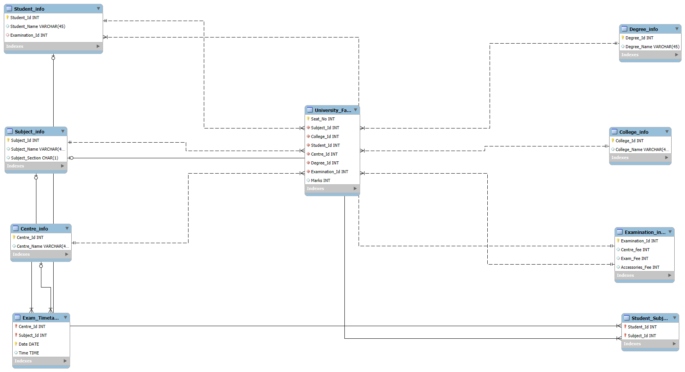

# 🎓 University Exam Data Warehouse – Star Schema Design

This repository contains the Entity-Relationship Diagram (ERD) and schema design for a **University Examination Management System** modeled using the **Star Schema** approach.

## 📌 Objective

To build a scalable, analytical-friendly data model that helps universities:
- Track student performance
- Analyze subject-wise and college-wise results
- Manage exam scheduling and center allocation
- Evaluate examination fee structures

## 🧩 Schema Overview

The core of this data warehouse is a **fact table** that records exam-related performance data, surrounded by multiple **dimension tables** for easier filtering and analysis.

### 🛠️ Fact Table

| Table Name        | Description                             |
|-------------------|-----------------------------------------|
| `University_Fact` | Stores marks, seat numbers, and references to all dimension tables. |

#### Columns:
- `Seat_No`
- `Student_Id`
- `Subject_Id`
- `College_Id`
- `Centre_Id`
- `Degree_Id`
- `Examination_Id`
- `Marks`

---

### 🧱 Dimension Tables

| Table Name           | Description                              |
|----------------------|------------------------------------------|
| `Student_info`       | Details of students                     |
| `Subject_info`       | Subjects and their sections             |
| `College_info`       | Participating colleges                  |
| `Centre_info`        | Exam centers                            |
| `Degree_info`        | Degrees offered                         |
| `Examination_info`   | Fee-related and exam metadata           |
| `Exam_Timetable`     | Schedule for exams                      |
| `Student_Subject`    | Junction table for student–subject mapping |

---

## 📈 Use Cases Supported

- 🎯 **Subject-wise performance** analytics
- 🏫 **College-wise result comparison**
- 💰 **Fee analysis** per exam type
- 🕒 **Timetable tracking** by subject and center
- 📊 Ready for BI tools like **Power BI**, **Tableau**, and **Looker**

---

## 📌 ERD Diagram

---

🤝 Contributions
Feel free to fork this repo, suggest improvements, or raise issues if you find bugs or have feature ideas.

📬 Contact
Sahil Talathi
Microsoft Certified Fabric Data Engineer Associate
